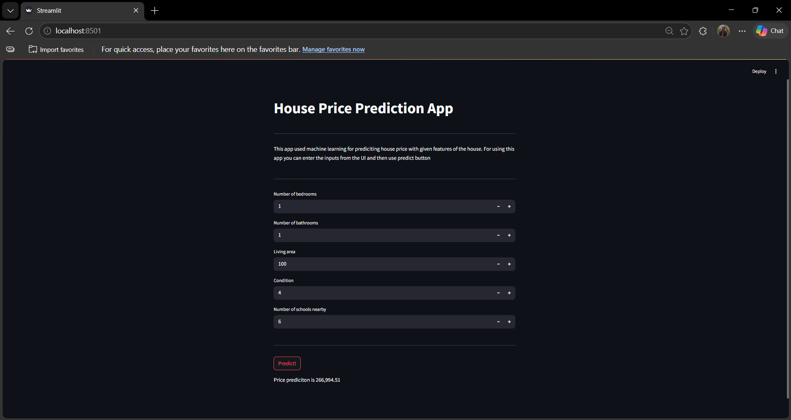

# House_Price_Prediction_ML

## 1. Project Title / Headline  
An end-to-end Machine Learning pipeline that predicts house prices based on key property features, deployed as an interactive Streamlit web application.

## 2. Short Description / Purpose  
This project transforms raw Indian housing data into a deployable price prediction tool. By analyzing features like living area, bedrooms, bathrooms, house condition, and nearby schools, the model estimates market price — served through a simple web app that requires no coding to use.

## 3. Tech Stack  
- **Python** - Data analysis, modeling, and app development
- **Pandas/Numpy** - Data loading, exploration, and preprocessing
- **Matplotlib & Seaborn** – Exploratory visualizations 
- **Scikit-learn** – Model training, GridSearchCV tuning and evaluation
- **Joblib** – Model serialization (model.pkl)
- **Streamlit** – Interactive web application
- **File Format** – `.ipynb` ,`.py`,`.pkl` and `.csv`

## 4. Data Source  
- Source: Kaggle–House Prices India
- Volume: 14,619 rows × 23 columns, No missing values, No duplicates
- Target Variable: price (Range: ₹78,000 – ₹77,00,000 | Mean: ₹5,38,806)
- Feature Variables: number_of_bedrooms, number_of_bathrooms, living_area, condition_of_the_house, number_of_schools_nearby

## 5. Features / Highlights
### Model Comparison (GridSearchCV, 80/20 Split)
Three models were trained and tuned using GridSearchCV:
- Decision Tree Regressor — Best params: friedman_mse, max_depth=10, random splitter → MAE: ₹1,63,808
- Linear Regression — Default parameters → MAE: ₹1,63,115
- Random Forest Regressor — Best params: max_depth=5, n_estimators=9 → MAE: ₹1,58,260

### Streamlit Web App
Users input house features via the UI and click Predict! to receive an instant price estimate.
```python
pip install streamlit joblib scikit-learn numpy
streamlit run app.py
```

#### Sample Predictions:
- 1 bed | 1 bath | 100 sqft | Condition 4 | 6 schools → ₹2,66,994.51
- 4 bed | 2 bath | 1000 sqft | Condition 4 | 2 schools → ₹3,09,556.77

## 6. Features / Highlights
- GridSearchCV – Random Forest (Best Model)
```python
rfr = RandomForestRegressor()
param_grid = {"max_depth": [5, 10, 15], "n_estimators": [2,3,4,5,6,7,8,9,10]}
grid_rfr = GridSearchCV(rfr, param_grid)
grid_rfr.fit(X_train, y_train)
# Best: {'max_depth': 5, 'n_estimators': 9} | MAE: 158260.65
```

- Saving & Loading the Model
```python
import joblib
joblib.dump(grid_rfr, "model.pkl")   # Save
model = joblib.load("model.pkl")     # Load in Streamlit
```

## 7. Business Impact & Insights
- Living area, condition, and nearby schools are the strongest price drivers
- Random Forest outperformed both Linear Regression and Decision Tree, reflecting non-linear relationships in the data
- The Streamlit app makes price estimation accessible to buyers, sellers, and agents — no data science background needed

## 8. Screenshots / Demos  


